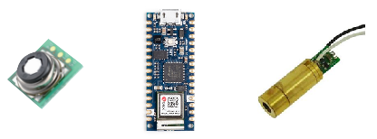
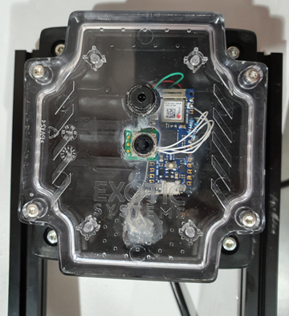

# Module Thermopile

## Principe

Ce wiki traite de l'utilisation de la thermopile. Une thermopile est un dispositif électronique qui convertit l'énergie thermique en énergie électrique. Elle est composée de plusieurs thermocouples connectés généralement en série ou, plus rarement, en parallèle. Un tel dispositif fonctionne selon le principe de l'effet thermoélectrique, c'est-à-dire qu'il génère une tension lorsque ses métaux différents (thermocouples) sont exposés à une différence de température. Ici la différence de température est celle entre l'arrière de la thermopile (à la température ambiante) et celle faisant face à l'objet à mesurer dont on reçoit le rayonnement.

## Spécifications

Les thermopiles se différencient entre autres par leur champ de vue et leur gamme de température. Nous avons sélectionné un modèle à faible champ de vue et une gamme de températures ambiantes (0 à 85°C). 

| Fabricant   | Texas Instruments           |
| ----------- | --------------------------- |
| Modèle      | **OMRON D6T-1A-01**         |
| Temp range  | -20°C à 80°C                |
| angle 50%   | 58°                         |

Il s'agit d'un modèle pour intégration industrielle, donc c'est un capteur seul qu'il a fallu packager dans une carte électronique et un boitier ExoticSystems customisé. 

## Montage et composants

Le bloc thermopile est composé des éléments suivants:
- boitier baliz Exotic Systems
- Thermopile
- Carte ARDUINO NANO 33 IOT
- Laser de pointage 5mW (modèle pour arduino ANGEEK XF0085X5 650nm)
- Connecteur micro-USB à l'arrière

Les différents éléments sont assemblée par colle à pistolet ou soudure plomb dans le boitier grenouille d'Exotic. Le laser de pointage est monté dans le même axe vertical que la thermopile, 20mm plus bas, et est matérialisé par un clignotement du pointeur rouge. Il est recommandé d'indiquer un risque pour les yeux (laser classe IIIA).
Le connecteur arrière remplace le connecteur natif de la carte Nano 33 IoT.

## Positionnement: 

Il n'y a pas de seuil de distance d'utilisation, seul la contrainte de largeur de champ prévaut. L'angle de champ est de 58° et donne donc, pour différentes distances, un champ en largeur de:

| distance à la cible | largeur de perception pour 90% du flux |
| ------------------- | -------------------------------------- |
| 20cm                | 22cm                                   |
| 35cm                | 38cm                                   |
| 60cm                | 66cm                                   |

On voit donc qu'on peut éloigner la thermopile jusqu'à 35cm de sa cible, ensuite on débordera sur les côtés du KM et on mesurera alors également le support ou des objets avoisinants. On recommande donc de bien centrer la thermopile au dessus du KM, ou de la rapprocher. 

## Acquisition et script

Pour verser le script sur la carte arduino, il faut se connecter au mini-usb arrière et on met à jour le firmware en ouvrant l'IDE Arduino, sélectionnant le port actif et la carte Nano 33 dans le menu. Arduino peut nécessiter une mise à jour pour télécharges les modules Nano 33. 

L'acquisition des données de la thermopile se fait via le port série, et donc le script **serialObject.py**[lien direct](https://gitlab.com/exoticsystems/michelin-pose-km/soudure-km/-/blob/master/serialObject.py) qui définit une classe permettant de faire communiquer nos objets en USB.

La thermopile envoie une trame de données à intervalle constant. Les différentes phase de mesure sont:
- création d'un sampler toutes les 400ms
- récupération des données
- allumage du laser en mode clignotement pendant 300ms au total)

Les deux valeurs renvoyées dans le string sont à décomposer en:

| Température | Explication                                           |
| ----------- | ----------------------------------------------------- |
| PTAT        | Température du thermocouple interne en degrés celsius |
| THPI        | Température de l'objet distant en degrés celcius      |

On peut utiliser la ligne suivante pour splitter le string et récupérer les valeurs de température dans une liste:

`numericdata = re.findall("\d*\.\d+", rawdata)`

On pourra utiliser la classe serialObject() définie dnas le repository soudureKM pour récupérer les données. 

## Qualité et robustesse de mesure

Les tests de robustesse sur le banc de test ont pu montrer que:

- La documentation technique ne fournit pas de correction pour le facteur d'émissivité, et on fait l'hypothèse qu'il est corrigé automatiquement ou négligeable.
- La température mesurée par la thermopile est dans tous les cas exacte à +/-1°C de la vraie température en étuve. 
- Un éclairage direct fort sur la cible va modifier sa température de surface et être détecté par la thermopile (la température de surface serait alors plus élevée que la température interne du KM)
- Un éclairage fort (type halogène) vers la thermopile va fausser les mesures à la hausse.